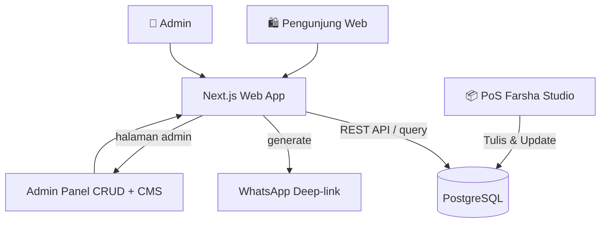
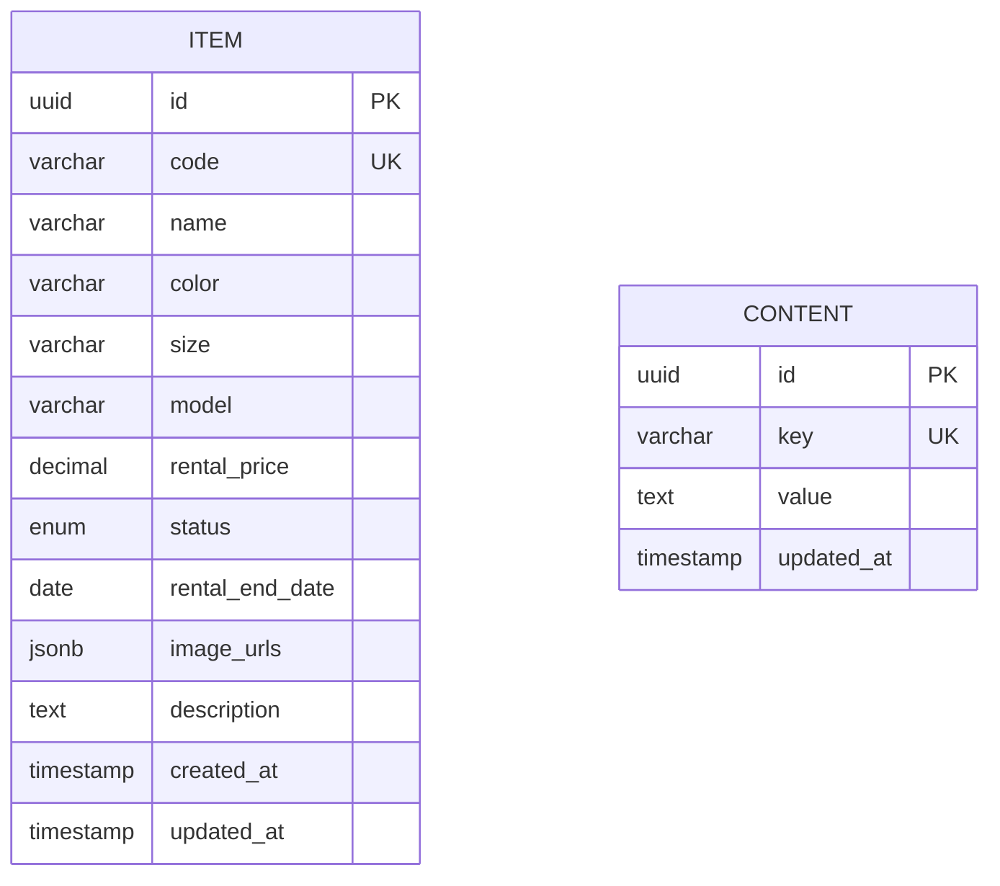

# PRD — Project Requirements Document

## 1. Overview
Farsha Studio memiliki ratusan koleksi kebaya yang disewakan, namun selama ini katalog hanya bisa dilihat langsung di studio atau lewat foto kiriman. Pengunjung kesulitan mengecek koleksi dan ketersediaan secara mandiri.  
Website showcase ini hadir sebagai etalase digital pertama Farsha Studio—menampilkan seluruh koleksi kebaya dengan antarmuka bersih ala Zara & TheVolte, mobile-first, dan sangat ringan. Pengunjung cukup melihat-lihat, memfilter sesuai keinginan, lalu menuju WhatsApp dengan satu klik untuk menanyakan ketersediaan lebih lanjut. Transaksi tetap dilakukan sepenuhnya di studio, tanpa ada proses pemesanan online. Seluruh status ketersediaan barang real-time terpantau karena data berasal dari sumber yang sama dengan mesin Point of Sale (PoS) yang dikelola sendiri oleh Farsha Studio.

## 2. Requirements
- Website showcase katalog penyewaan kebaya dengan desain minimalis-elegan.
- **Mobile-first** dan kecepatan loading tinggi, dioptimalkan untuk pengalaman jelajah di ponsel.
- Terintegrasi langsung dengan database PoS Farsha Studio sebagai *single source of truth* — status barang (Tersedia/Disewa/Maintenance/Arsip) tampil *real-time* di web.
- Filter katalog multi-kriteria: warna, ukuran, model, kisaran harga sewa, status ketersediaan.
- **Grid view switcher responsif perangkat**:
  - Pada layar mobile, hanya tersedia dua pilihan: **1 kolom** (tampilan timeline ala Instagram dengan swipable carousel gambar di setiap kartu) dan **2 kolom** (gaya e-commerce dengan dua kartu berdampingan).
  - Pada layar **desktop**, pengguna dapat memilih **2, 3, atau 4 kolom** per baris sesuai selera.
- Setiap item memiliki kode unik; tombol “Cek Ketersediaan via WhatsApp” akan membuka WhatsApp dengan pesan otomatis berisi nama produk dan kode item.
- Admin panel tunggal (single admin) dengan dua fungsi utama:  
  1. Kelola katalog yang sinkron dengan PoS.  
  2. Mini-CMS terstruktur (field tetap) untuk mengubah konten hero/banner/promosi di halaman depan.
- Tidak ada checkout, pembayaran, atau booking online — transaksi terjadi offline di studio.

## 3. Core Features
- **Katalog dengan grid dinamis**  
  - **Mobile**: switcher menampilkan dua opsi: (1) **1 kolom** — setiap kartu memenuhi lebar layar, di dalamnya terdapat **swipable carousel gambar** (pengguna bisa menggeser horizontal untuk melihat foto-foto lain dari item yang sama), mirip unggahan Instagram; (2) **2 kolom** — dua kartu berdampingan seperti layout e-commerce pada umumnya.  
  - **Desktop**: switcher menyediakan opsi 2, 3, atau 4 kolom per baris; tanpa carousel, tiap kartu menampilkan satu foto utama.  
  - Semua kartu menampilkan foto (utama atau carousel), nama item, harga sewa, dan badge status.
- **Filter pintar & real-time**  
  Filter: warna, ukuran, model, rentang harga sewa, status (Tersedia/Disewa/Maintenance/Arsip). Hasil diperbarui langsung tanpa reload halaman.
- **Halaman detail item**  
  Galeri foto, informasi lengkap (warna, ukuran, model, harga, status + estimasi kembali), tombol WhatsApp satu klik.
- **Deep-link WhatsApp**  
  Saat tombol ditekan, langsung membuka WhatsApp (aplikasi atau web) dengan teks: *“Halo, saya tertarik dengan [Nama Item] (kode: [Kode]). Apakah masih tersedia?”*
- **Status ketersediaan real-time**  
  Data langsung terbaca dari database yang sama dengan PoS Farsha Studio, sehingga setiap perubahan status oleh PoS langsung tampil di web.
- **Admin panel (single admin)**  
  - Manajemen katalog: melihat daftar item (termasuk yang disinkronisasi PoS), menambah/menyunting item, mengubah harga sewa, mengatur foto.  
  - Mini-CMS: mengisi konten hero (judul, subjudul, gambar), teks promosi, bagian “Tentang Kami”, dll., tanpa builder rumit.
- **Estetika & performa**  
  Tampilan *clean-minimal* fokus pada visual kebaya; optimasi gambar, lazy loading, serta server-side rendering untuk kecepatan akses.

## 4. User Flow
### Pengunjung biasa
1. Masuk ke beranda → melihat hero banner dan promosi terbaru.
2. Menuju halaman **Katalog**.
3. Menyesuaikan tampilan grid melalui switcher:  
   - Di **ponsel**: pilih antara **1 kolom** (timeline Instagram, carousel swipable) atau **2 kolom** (e-commerce).  
   - Di **desktop**: pilih 2, 3, atau 4 kolom.  
4. Menerapkan filter (warna, ukuran, model, harga, status) sesuai kebutuhan.
5. Menelusuri koleksi:  
   - Di mode **1 kolom mobile**, pengguna dapat **menggeser (swipe) foto di dalam kartu** untuk melihat variasi gambar item sebelum memutuskan membuka detail.  
   - Di mode lainnya, scroll biasa untuk melihat kartu-kartu produk.
6. Klik salah satu item → halaman detail dengan galeri foto dan info lengkap.
7. Tekan tombol **“Cek Ketersediaan via WhatsApp”** → otomatis membuka WA dengan pesan terisi.
8. Lanjut percakapan di WhatsApp, lalu datang ke studio untuk transaksi offline.

### Admin
1. Login ke panel admin (akses terbatas) melalui `/admin`.
2. **Katalog**: lihat seluruh koleksi, tambah/edit item, pastikan status terpantau. Item yang baru ditambahkan PoS akan muncul otomatis di sini (sinkron database).
3. **CMS**: buka halaman pengaturan konten, isi kolom tetap (hero title, subtitle, gambar, teks promosi), lalu simpan — perubahan langsung terlihat di web.

## 5. Architecture
Sistem mengandalkan **satu database bersama** (PostgreSQL) yang digunakan oleh website Next.js dan aplikasi PoS Farsha Studio. PoS secara mandiri mengelola transaksi dan mengupdate status item (mis. menyewa, kembali, maintenance). Website Next.js hanya membaca data dari database itu via API, menampilkan katalog secara real-time. Admin panel berjalan di dalam Next.js yang sama, dengan otentikasi admin.

Komponen utama:
- **Next.js Frontend** (App Router) — menyajikan halaman publik (beranda, katalog, detail) dan halaman admin.
- **Next.js API Routes** — lapisan logika untuk membaca data katalog, konten CMS, serta autentikasi admin.
- **Drizzle ORM** — menjembatani API dengan PostgreSQL.
- **Better Auth** — menangani login admin (single account).
- **PoS Internal** — aplikasi terpisah (mis. desktop/mobile) yang juga terkoneksi langsung ke database yang sama, bertanggung jawab memperbarui status penyewaan.

## 6. Database Schema
Database utama menampung data katalog dan konten mini-CMS. PoS mengelola transaksi di tabel terpisah, tetapi status item tetap tercermin di tabel `item` melalui kolom `status` dan `rental_end_date`.

### Tabel: `item`
| Kolom            | Tipe            | Keterangan |
|------------------|-----------------|------------|
| id               | UUID (PK)       | ID unik item |
| code             | VARCHAR(20) UNIQUE | Kode item (untuk pesan WA) |
| name             | VARCHAR(255)    | Nama kebaya |
| color            | VARCHAR(50)     | Warna (dipakai di filter) |
| size             | VARCHAR(20)     | Ukuran (S, M, L, XL, custom) |
| model            | VARCHAR(100)    | Model (mis. Modern, Klasik, Brokat) |
| rental_price     | DECIMAL         | Harga sewa per hari |
| status           | ENUM('available','rented','maintenance','archived') | Status ketersediaan |
| rental_end_date  | DATE NULL       | Tanggal kembali (hanya terisi jika status = 'rented') |
| image_urls       | JSONB           | Array URL foto (minimal 1) |
| description      | TEXT            | Deskripsi opsional |
| created_at       | TIMESTAMP       | Waktu data dibuat |
| updated_at       | TIMESTAMP       | Waktu perubahan terakhir |

### Tabel: `content` (mini-CMS)
| Kolom            | Tipe            | Keterangan |
|------------------|-----------------|------------|
| id               | UUID (PK)       | ID konten |
| key              | VARCHAR(50) UNIQUE | Identitas elemen (cth: `hero_title`, `hero_subtitle`, `promo_text`) |
| value            | TEXT            | Isi konten (bisa teks biasa atau Markdown) |
| updated_at       | TIMESTAMP       | Terakhir diubah |

Integritas data dan konsistensi status dijamin karena PoS dan web mengacu pada database yang sama; setiap perubahan PoS langsung terefleksi di web tanpa delay.

## 7. Tech Stack
- **Frontend & Backend**: [Next.js](https://nextjs.org/) (App Router) — full-stack React framework.
- **Styling**: [Tailwind CSS](https://tailwindcss.com/) untuk desain cepat dan konsisten, serta estetika minimalis.
- **UI Components**: [shadcn/ui](https://ui.shadcn.com/) — komponen siap pakai yang dapat dikostumisasi.
- **ORM & Database**: [Drizzle ORM](https://orm.drizzle.team/) + **PostgreSQL** (database server yang dapat diakses oleh PoS dan web, menjamin *single source of truth*).
- **Autentikasi**: [Better Auth](https://better-auth.com/) untuk login admin (sesi aman, terintegrasi Next.js).
- **Deployment**: Vercel (Next.js), dengan database PostgreSQL cloud (mis. Railway, Supabase, atau Neon) — memudahkan PoS mengakses database melalui koneksi langsung dengan aman.
- **WhatsApp Integration**: Deep-link `wa.me/<nomor_studio>?text=...` tanpa library tambahan.
